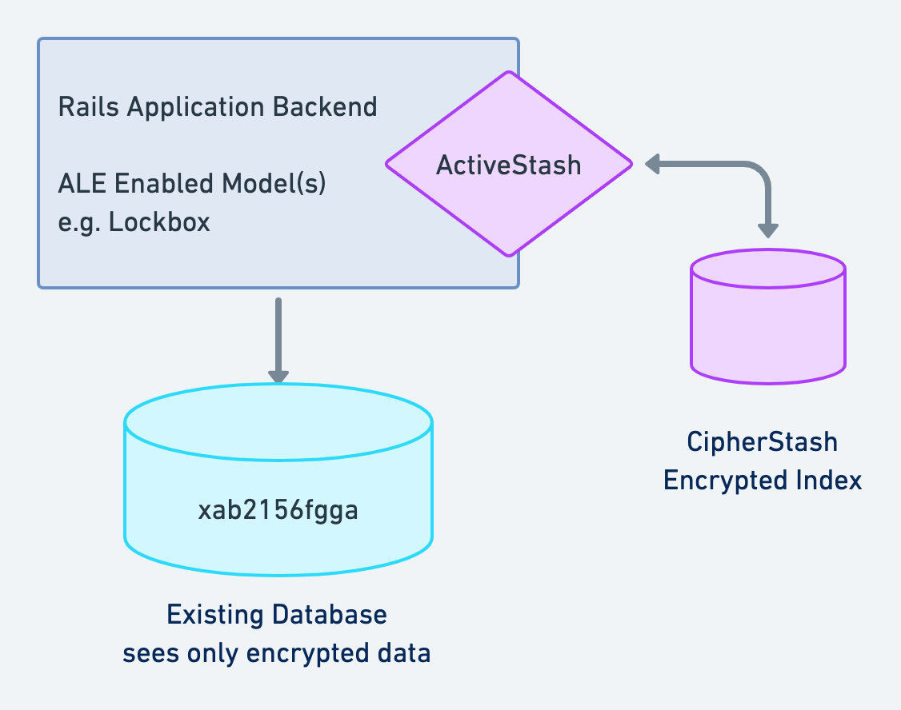

# ActiveStash

[ActiveStash](https://cipherstash.com/activestash) is the Rails-specific gem for using [CipherStash](https://cipherstash.com).

ActiveStash gives you encrypted search on ActiveRecord models using application level encryption (using libraries like [Lockbox](https://github.com/ankane/lockbox) and [ActiveRecord Encryption](https://guides.rubyonrails.org/active_record_encryption.html)).

When records are created or updated, they are indexed into a CipherStash collection which can be queried via an `ActiveStash::Relation`.

## TL;DR - here's a video demo

Searchable Encrypted Rails models with ActiveStash!

[](https://www.youtube.com/watch?v=SmRblnWV_VY)

## What is CipherStash?

Field-level encryption is a powerful tool to protect sensitive data in your Active Record models.
However, when a field is encrypted, it can't be queried!
Simple lookups are impossible let alone free-text search or range queries.

This is where CipherStash comes in.
CipherStash is an Encrypted Search Index and using ActiveStash allows you to perform exact, free-text and
range queries on your Encrypted ActiveRecord models.
Queries use `ActiveStash::Relation` which wraps `ActiveRecord::Relation` so _most_ of the queries you can do in
ActiveRecord can be done using ActiveStash.

## How does it work?

ActiveStash uses the "look-aside" pattern to create an external, fully encrypted index for your ActiveRecord models.
Every time you create or update a record, the data is indexed to CipherStash via ActiveRecord callbacks.
Queries are delegated to CipherStash but return ActiveRecord models so things just work.

If you've used Elasticsearch with gems like [Searchkick](https://github.com/ankane/searchkick), this pattern will be familiar to you.



## Getting started

1. Add ActiveStash to your `Gemfile`:

```
gem "active_stash"
```

2. Install the new dependencies:

```
➜  bundle install
```

3. Sign up for a CipherStash account, and then login with the provided Workspace ID:

```bash
➜  rake active_stash:signup
➜  rake active_stash:login[YOURWORKSPACEID]
```

Note: If you are using `zsh` you may need to escape the brackets

```bash
rake active_stash:login\['WorkspaceId'\]
```

4. Any model you use with `ActiveStash::Search` needs to have a `stash_id` column, to link search results back to database records.

For example, to add a `stash_id` column to the database table for the `User` model, add the below migration:

```sh
$ rails g migration AddStashIdToUser stash_id:string:index
$ rails db:migrate
```

5. Add the `ActiveStash::Search` mixin to your user model, and declare what fields are searchable:

```ruby
# app/models/user.rb
class User < ApplicationRecord
  include ActiveStash::Search

  # Previously added application-level encryption, by either ActiveRecord Encryption or Lockbox
  encrypts :name, :email
  encrypts :dob, type: :date

  # Fields that will be indexed into CipherStash
  stash_index :name, :email, :dob

  self.ignored_columns = %w[name email dob]
end
```

6. Reindex your existing data into CipherStash with ActiveStash

```
➜  rails active_stash:reindexall
```

7. Query a user record:

```bash
$ rails c
 >> User.where(email: "grace@example.com")
 => []  # no records, because the database isn't searchable
 >> User.query(email: "grace@example.com")
 => [
   #<User:0x00000001138a42b0
  id: 7,
  name: "Grace Hopper",
  email: "grace@example.com",
  stash_id: "6481b6dd-8e0f-456c-ac27-6c668ca539f2",
 ] # a record, because CipherStash makes your encrypted database searchable
```

## Installation

Add this line to your applications Gemfile:

```ruby
gem 'active_stash'
```

And then execute:

```sh
$ bundle install
```

To use, include ActiveStash::Search in a model and define which fields you want to make searchable:

```ruby
class User < ActiveRecord::Base
  include ActiveStash::Search

  # Searchable fields
  stash_index :name, :email, :dob

  # fields encrypted with EncryptedRecord
  encrypts :name
  encrypts :email
  encrypts :dob

  # ...the rest of your code
end
```

Any model in which you include ActiveStash::Search, will need to have a `stash_id` column added of type `string`.
For example, to add this to the table underlying your `User` model:

```sh
$ rails g migration AddStashIdToUser stash_id:string:index
$ rails db:migrate
```

The above command also ensures that an index is created on `stash_id`.

## Configuration

ActiveStash supports all CipherStash configuration described in [the docs](https://docs.cipherstash.com/reference/client-configuration.html).

In addition to configuration via JSON files and environment variables, ActiveStash supports Rails config and credentials.

For example, to use a specific profile in development, you could include the following in `config/environments/development.rb`:

```ruby
Rails.application.configure do
  config.active_stash.profile_name = "dev-profile"

  # Other config...
end
```

For secrets, you can add ActiveStash config to your credentials (`rails credentials:edit --environment <env>`):

```yaml
active_stash:
  aws_secret_access_key: your_secret
```

You can also use an initializer (e.g. `config/initializers/active_stash.rb`):

```ruby
ActiveStash.configure do |config|
  config.aws_secret_access_key = Rails.application.credentials.aws.secret_access_key
end
```

## Index Types

CipherStash supports 3 main types of indexes: `exact`, `range` (allows queries like `<` and `>`)
and `match` which supports free-text search.

ActiveStash will automatically determine what kinds of indexes to create based on the underlying data-type.
These are as follows:

### String and Text

`:string` and `:text` types automatically create the following indexes.
Range indexes on strings typically only work for ordering.

| Indexes Created | Allowed Operators          | Example                                |
| --------------- | -------------------------- | -------------------------------------- |
| `match`         | `=~`                       | `User.query { \|q\| q.name =~ "foo" }` |
| `exact`         | `==`                       | `User.query(email: "foo@example.com)`  |
| `range`         | `<`, `<=`, `==`, `>=`, `>` | `User.query.order(:email)`             |

### Numeric Types

`:timestamp`, `:date`, `:datetime`, `:float`, `:decimal`, and `:integer` types all have `range` indexes created.

| Indexes Created | Allowed Operators                     | Example                                     |
| --------------- | ------------------------------------- | ------------------------------------------- |
| `range`         | `<`, `<=`, `==`, `>=`, `>`, `between` | `User.query { \|q\| q.dob > 20.years.ago }` |

### Overriding Automatically Created Indexes

If you need finer grained control over what types of indexes are created for a field, you can pass the `:except` or
`:only` options to `stash_index` (can be a symbol or array).

For example, to on create an `:exact` index for an integer field, you could do:

```ruby
stash_index :my_integer, only: :exact
```

To exclude the `:range` from a string type (say if you don't need to order by string), you can do:

```ruby
stash_index :my_string, except: :range
```

## Match All Indexes

ActiveStash can also create an index across multiple string fields so that you can perform free-text queries across all specified fields at once.

To do so, you can use the `stash_match_all` DSL method and specify the fields that you want to have indexed:

```ruby
stash_match_all :first_name, :last_name, :email
```

Match all indexes are queryable by passing the query term directly to the `query` method.
So to search for the term "ruby" across `:first_name`, `:last_name` and `:email` you would do:

```ruby
User.query("ruby")
```

For more information on index types and their options, see the [CipherStash
docs](https://docs.cipherstash.com/reference/index-types/index.html).


## Match Index Filter Options

You can adjust the parameters of the filters used for match indexes by passing the `filter_term_bits` and/or `filter_size` options to `stash_index` or `stash_match_all`:

```ruby
stash_index :my_string, filter_size: 512, filter_term_bits: 6
stash_match_all :first_name, :last_name, :email, filter_size: 1024, filter_term_bits: 5
```

For more information on filter parameters, see the [CipherStash docs](https://docs.cipherstash.com/reference/index-types/match.html#common-options).


## Unique indexes

ActiveStash supports adding server side unique constraints on fields.

Unique fields can be specified by adding `unique: true`.

In the below example a unique constraint is added to the email field.

```ruby
class User < ActiveRecord::Base
  include ActiveStash::Search

  stash_index :name, :dob
  stash_index :email, unique: true

  encrypts :name
  encrypts :email
  encrypts :dob
end
```

ActiveStash does not support adding unique constraints on `:match` indexes.

The below example will result in a `ConfigError` being raised.

```ruby
stash_index :email, only: :match, unique: true
```


## Create a CipherStash Collection

Before you can index your models, you need a CipherStash collection.
ActiveStash will create indexes as defined in your models.

All you need to do is create the collection by running:

    rails active_stash:collections:create

This command will create collections for all the models you have set up to use ActiveStash.

## (Re)indexing

To index your encrypted data into CipherStash, use the reindex task:

```sh
$ rails active_stash:reindexall
```

If you want to just reindex one model, for example `User`, run:

```sh
$ rails active_stash:reindex[User]
```

You can also reindex in code:

```ruby
User.reindex
```

Depending on how much data you have, reindexing may take a while but you only need to do it once.
_ActiveStash will automatically index (and delete) data as it records are created, updated and deleted._

## Uniqueness Validations

Standard ActiveRecord uniqueness validations won't work when data is encrypted.
While it *can* work in some cases when using deterministic encryption, we generally recommend against this approach
(deterministic encryption is vulnerable to inference and chosen-plaintext attacks).

Instead, you can include `ActiveStash::Validations` and your uniqueness validation will now work via a query
to the CipherStash index on the validated field.
If there is no index on the field then validations will fail.

Note that uniqueness validations in ActiveStash are **always** _case sensitive_.

Also, note that as of now the `ActiveStash::Validations` does not support the `:scope` or `:conditions` options.
All [other options](https://api.rubyonrails.org/classes/ActiveRecord/Validations/ClassMethods.html#method-i-validates_uniqueness_of)
are supported.

```ruby
class Person < ApplicationRecord
  include ActiveStash::Search
  include ActiveStash::Validations

  validates :email, uniqueness: true
end
```

## Current limitations

Presently, ActiveStash provides no means to update the schema of a CipherStash collection. Therefore if you need to make any changes to the Collection schema itself (by using the `stash_index` or `stash_match_all` helpers) you must drop your collection and recreate it.

If your indexed model is called `User` for example, you should run the following commands:

```sh
$ rails active_stash:drop[User]
$ rails active_stash:create
$ rails active_stash:reindex[User]
```

Support for zero-downtime Collection schema changes and reindexing is being actively worked on and will be available soon.

### When to Reindex Your Collection

These are the rules for when you _must_ re-index your collection:

1. You have imported, deleted or updated data in the table that backs your ActiveStash model via some external mechanism, OR
2. You have added or removed a string/text column from the table that backs your ActiveStash model _and_ you are using a `dynamic_match` index in your model

### When to Drop, Recreate and Reindex Your Collection

This is the rule to determine when you _must_ drop, recreate and reindex your collection:

1. Whenever add or modify one or more ActiveStash index definitions in your model

See [Current Limitations](#current-limitations) for instructions on what commands to run to accomplish this.

_NOTE:_ technically, you do not need to reindex your collection if you _remove_ an index definition on your model. A removed index definition will not remove the index stored in CipherStash and it will not be useable in queries, but it will still be incurring CPU & network costs to keep it up to date.

## Running Queries

To perform queries over your encrypted records, you can use the `query` method
For example, to find a user by email address:

```ruby
User.query(email: "person@example.com")
```

This will return an ActiveStash::Relation which extends `ActiveRecord::Relation` so you can chain _most_ methods
as you normally would!

To constrain by multiple fields, include them in the hash:

```ruby
User.query(email: "person@example.com", verified: true)
```

To order by `dob`, do:

```ruby
User.query(email: "person@example.com").order(:dob)
```

Or to use limit and offset:

```ruby
User.query(verified: true).limit(10).offset(20)
```

This means that `ActiveStash` should work with pagination libraries like Kaminari.

You also, don't have to provide any constraints at all and just use the encrypted indexes for ordering!
To order all records by `dob` descending and then `created_at`, do (note the call to query with no args first):

```ruby
User.query.order(dob: :desc, created_at: :asc)
```

### Retrieving just Stash IDs

If you need to "join" the results of an ActiveStash query against another model, it can be wasteful to load all the model objects just to have to throw them away again.
In this case, you can use the `ActiveStash::Relation#stash_ids` method to execute the query and only return the record IDs, like this example to find young employees:

```ruby
youngster_ids = User.query { |q| q.dob > "2000-01-01".to_date }.stash_ids
young_employees = Employee.joins(:user).where("users.stash_id IN (?)", youngster_ids)
```

### Advanced Queries

More advanced queries can be performed by passing a block to `query`.
For example, to find all users born in or after 1998:

```ruby
User.query { |q| q.dob > "1998-01-01".to_date }
```

Or, to perform a free-text search on name:

```ruby
User.query { |q| q.name =~ "Dan" }
```

To combine multiple constraints, make multiple calls in the block:

```ruby
User.query do |q|
  q.dob > "1998-01-01".to_date
  q.name =~ "Dan"
end
```

## Overriding the Collection Name

To set a different collection name, you can set one in your model:

```ruby
class User < ActiveRecord::Base
  include ActiveStash::Search
  self.collection_name = "mycollection"
end
```

## Setting a Default Scope

If you plan to use encrypted queries for all the data in your model, you can set a default scope:

```ruby
class User < ActiveRecord::Base
  include ActiveStash::Search

  def self.default_scope
    ActiveStash::Relation.new(self)
  end
end
```

Now, all queries will use the CipherStash collection, even if you don't call `query`.
For example, this will use encrypted indexes to order:

```ruby
User.order(:dob)

# Without a default scope you'd need to call
User.query.order(:dob)
```

## Managing Access Keys

Access keys are secret credentials that allow your application to authentication to CipherStash when it is running in a non-interactive environment (such as production or CI).
ActiveStash provides rake tasks to manage the access keys for your workspace.

To create a new access key:

```sh
rake active_stash:access_key:create[keyname]
```

To list all the access keys currently associated with your workspace:

```sh
rake active_stash:access_key:list
```

Finally, to delete an access key:

```sh
rake active_stash:access_key:delete[keyname]
```

Every access key must have a unique name, so you know what it is used for (and so you don't accidentally delete the wrong one).
You can have as many access keys as you like.

## Collection Management

### Drop a Collection

You can drop a collection directly in Ruby:

```ruby
User.collection.drop!
```

Or via the included Rake task.
This command takes the name of the _model_ that is attached to the collection.

```sh
rake active_stash:collections:drop[User]
```

### List Stash Enabled Models

A rake task is provided to list all of the models in your application that have been configured to use CipherStash.

```sh
rake active_stash:collections:list
```

### Create a Collection

You can also create a collection for a specific model in Ruby:

```ruby
User.collection.create!
```

Or via a Rake task:

```sh
rake active_stash:collections:create[User]
```

## Assess

ActiveStash Assess is a tool to identify where sensitive data lives in your database, and tracking your progress on encrypting it.

ActiveStash Assess comes in two parts:

- A [Rake task](#user-content-rake-task) for identifying database fields that include sensitive data (like [Personally Identifying Information](https://docs.cipherstash.com/assess/checks#AS0001), [Protected Health Information](https://docs.cipherstash.com/assess/checks#AS0002))
- An [RSpec Matcher](#user-content-rspec-matcher) for verifying what fields have been encrypted in your database

### Rake task

ActiveStash includes a Rake task for assessing sensitive data used in a Rails application.

This command will print results to stdout in a human-readable format and write a results file to `active_stash_assessment.yml` in the Rails project root.
We recommend you commit this file to your repo, so you can track your progress on encrypting these fields over time.

To run an assessment and generate a report, run:
``` bash
rake active_stash:assess
```

This will print results to `stdout` in a human-readable format:

```
User:
- User.name is suspected to contain: names (AS0001)
- User.email is suspected to contain: emails (AS0001)
- User.gender is suspected to contain: genders (AS0001)
- User.ccn is suspected to contain: credit card numbers (AS0003)
- User.dob is suspected to contain: dates of birth (AS0001)

Online documentation:
- https://docs.cipherstash.com/assess/checks#AS0001
- https://docs.cipherstash.com/assess/checks#AS0003

Assessment written to: /Users/you/your-app/active_stash_assessment.yml
```

You can follow those links to learn more about why this data is considered sensitive, why adversaries want it, and what regulations and compliance frameworks cover this data.

The `active_stash:assess` Rake task also writes a results file to `active_stash_assessment.yml` in your Rails project root.

### RSpec matcher

After a report has been generated, you can use the `encrypt_sensitive_fields` RSpec matcher to verify that a model encrypts fields that were reported as sensitive by `rake active_stash:assess`.

First, make sure that the matcher is required in `spec/rails_helper.rb`:
```ruby
# near the top of rails_helper.rb
require 'active_stash/matchers'
```

Next, add the matcher to the spec for the model that you'd like to test. 
The following example verifies that all fields reported as sensitive for the `User` model are encrypted:
```ruby
describe User do
  it "encrypts sensitive fields", pending: "unenforced" do
    expect(described_class).to encrypt_sensitive_fields
  end
end
```

This helps you keep track of what fields you need to encrypt, as you incrementally roll out Application Level Encryption on your app.

As the example above shows, we recommend you start out by marking the test as [pending](https://relishapp.com/rspec/rspec-core/v/3-0/docs/pending-and-skipped-examples).
This will stop the test from failing while you incrementally encrypt database fields. 
Once you have encrypted all the fields identified by ActiveStash Assess, remove the pending so your tests will fail if the database field becomes unencrypted.

The `encrypt_sensitive_fields` matcher currently verifies that fields have been encrypted using [ActiveRecord Encryption](https://guides.rubyonrails.org/active_record_encryption.html), but support for [Lockbox](https://github.com/ankane/lockbox) is planned.

## Development

After checking out the repo, run `bin/setup` to install dependencies.

The test suite depends on a running postgres instance being available on localhost. You'll need to export a `PGUSER` env var before running the test suite.

Then, run `rake spec` to run the tests. You can also run `bin/console` for an interactive prompt that will allow you to experiment.

To install this gem onto your local machine:

1. Build the gem by running `rake gem`.

2. This will create a gem file (`active_stash-x.x.x.gem`) in the `./pkg` folder.

3. Install the gem by running `gem install` with the gem file name, e.g `gem install ./pkg/active_stash-x.x.x.gem`

## Making a Release

If you have push access to the GitHub repository, you can make a release by doing the following:

1. Run `git version-bump -n <major|minor|patch>` (see [the semver spec](https://semver.org) for what each of major, minor, and patch version bumps represent).

2. Write a changelog for the release, in Git commit style (headline on the first line, blank line, then Markdown text as you see fit).
   Save/exit your editor.
   This will automatically push the newly-created annotated tag, which will in turn kick off a release build of the gem and push it to [RubyGems.org](https://rubygems.org/gems/active_stash).

3. Run `rake release` to automagically create a new [GitHub release](https://github.com/cipherstash/activestash/releases) for the project.

... and that's it!

## Need help?

Head over to our [support forum](https://discuss.cipherstash.com/), and we'll get back to you super quick!

## Contributing

Bug reports and pull requests are welcome on GitHub at https://github.com/cipherstash/activestash. This project is intended to be a safe, welcoming space for collaboration, and contributors are expected to adhere to the [code of conduct](https://github.com/cipherstash/activestash/blob/master/CODE_OF_CONDUCT.md).

## License

The gem is available as open source under the terms of the [MIT License](https://opensource.org/licenses/MIT).

## Code of Conduct

Everyone interacting in the Activestash project's codebases, issue trackers, chat rooms and mailing lists is expected to follow the [code of conduct](https://github.com/cipherstash/activestash/blob/master/CODE_OF_CONDUCT.md).
